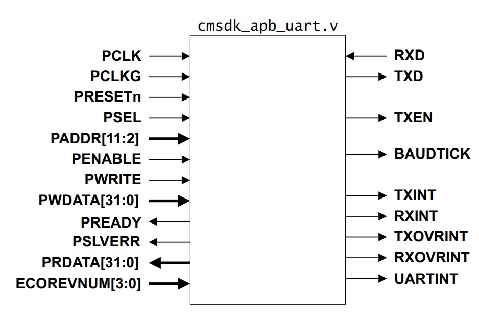
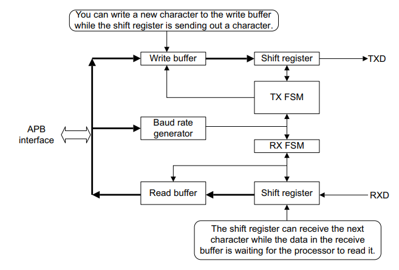
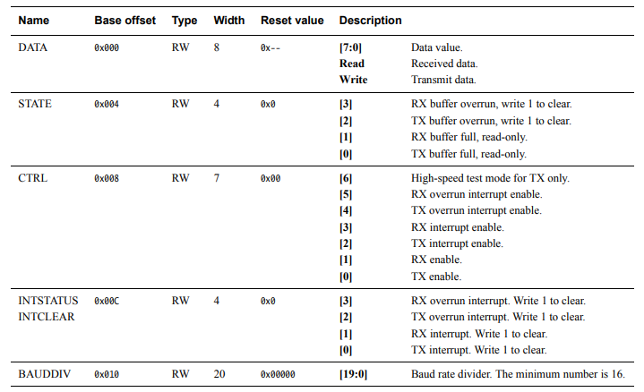
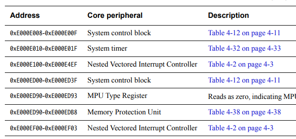

5、Log输出
==========================================

| 这一小节中，要为我们的程序增加log输出能力。
| 最终是依赖于板子的串口来输出的

5.1 UART 硬件
-------------------------------------------

我们的硬件平台是MPS2，使用的UART IP是 APB UART

| 参考：
| DDI0479D_m_class_processor_system_r1p1_trm.pdf
| DAI0385D_cortex_m3_on_v2m_mps2.pdf

我们关心得几个寄存器，设置波特率（BAUDDIV），使能控制（CTRL），数据输出（DATA）

我们使用UART0，基地址为0x40004000

5.2 UART 软件实现
-------------------------------------------

.. code-block:: C

	/*
	* Copyright (c) 2021-2031, Jinping Wu. All rights reserved.
	*
	* SPDX-License-Identifier: MIT
	*/

	#include <apbuart.h>

	typedef struct UART_t {
		volatile unsigned int DATA;
		volatile unsigned int STATE;
		volatile unsigned int CTRL;
		volatile unsigned int INTSTATUS;
		volatile unsigned int BAUDDIV;
	} UART_t;

	#define UART0_ADDR ((UART_t *)(0x40004000))

	#define UART_CTRL_TX_EN (1 << 0)
	#define UART_CTRL_RX_EN (1 << 1)

	/**
	* Initializes the UART
	*/
	void uart_init(void)
	{
		UART0_ADDR->BAUDDIV = 16;
		UART0_ADDR->CTRL = UART_CTRL_TX_EN;
	}

	/**
	* Output a char to the UART TX
	*/
	void uart_putc(char c)
	{
		UART0_ADDR->DATA =  c;
	}

.. note::
	代码很简单，初始化设置波特率，使能，输出字符通过往输出寄存器写内容来实现。之后在main里面先调用uart_init，再调用uart_putc('h')就能在qemu屏幕上输出'h'字符了。

5.3 Console 软件实现
-------------------------------------------

| 之前的代码只能一个个输出字符，而实际使用中，我们需要输出字符串，打印变量值等，一般这部分功能都是在C库中实现的。
| 但是我们没有C库，所以我们需要自己写

.. code-block:: C

	/*
	* Copyright (c) 2021-2031, Jinping Wu. All rights reserved.
	*
	* SPDX-License-Identifier: MIT
	*/

	#include <apbuart.h>

	#define MAX_DIGIT_BITS 11  /* 8 char for number, 2 for '0x' and 1 for '\n' */
	static const char HEX_TABLE[] = {'0', '1', '2', '3', '4', '5', '6', '7',
									'8', '9', 'A', 'B', 'C', 'D', 'E', 'F'};

	void bm_printf(char *s)
	{
		while (*s) {
			uart_putc(*s);
			s++;
		}
	}

	static void to_hex(unsigned int value, char msg[])
	{
		int i = MAX_DIGIT_BITS - 1;

		msg[i--] = '\n';
		for (; i > 1; i--, value >>= 4)
			msg[i] = HEX_TABLE[value & 0xF];
		msg[i--] = 'x';
		msg[i--] = '0';
	}

	static void bm_printf_hex(unsigned int value)
	{
		char value_str[MAX_DIGIT_BITS];

		for (int i = 0; i < MAX_DIGIT_BITS; i++)
			value_str[i] = 0;

		to_hex(value, value_str);
		bm_printf(value_str);
	}

	void bm_printf_value(char *s, unsigned int value)
	{
		bm_printf(s);
		bm_printf_hex(value);
	}

	void console_init(void)
	{
		uart_init();
	}

| 提供三个函数供外部调用：
| console_init 初始化串口，开机时调用
| bm_printf 打印字符串
| bm_printf_value 打印字符串和16进制变量值

5.4 代码结构 
-------------------------------------------

:: 

	.
	├── bm.lds
	├── build.sh
	├── Makefile
	├── README.md
	├── rungdb.sh
	├── runqemu.sh
	└── src
		├── board
		│   └── apbuart
		│       ├── apbuart.c
		│       └── apbuart.h
		├── common
		│   ├── console.c
		│   └── console.h
		├── core
		│   └── start.S
		├── main.c
		└── test

5.5 运行结果 
-------------------------------------------

.. code-block:: C

	int main(void)
	{
		unsigned int test = 0x12345678;

		console_init();
		bm_printf("Enter main!\n");
		bm_printf_value("This is test value:", test);
		return 0;
	}

::

	root@iZj6ccyu2ndokc2ujnox0tZ:~/workspace/code/baremetal/baremetal-m3# ./runqemu.sh 
	not use gdb, just run
	Enter main!
	This is test value:0x12345678

到这里我们的代码不仅支持C函数，还可以打印log了。

