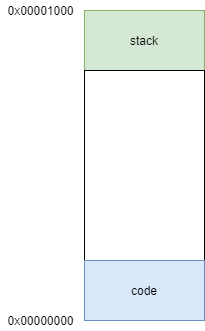

4、Main 函数
==========================================

这一小节中，要为我们的程序增加一个main函数，开始跑C程序

4.1 代码修改
-------------------------------------------

::

	root@iZj6ccyu2ndokc2ujnox0tZ:~/workspace/code/baremetal/baremetal-m3# tree
	.
	├── bm.lds
	├── build.sh
	├── Makefile
	├── README.md
	├── rungdb.sh
	├── runqemu.sh
	└── src
		├── board
		├── core
		│   └── start.S
		├── main.c
		└── test   

main 函数放在 src 目录下

.. code-block:: C

	/*
	* Copyright (c) 2021-2031, Jinping Wu. All rights reserved.
	*
	* SPDX-License-Identifier: MIT
	*/

	int main(void)
	{

	}

当前是一个空函数，什么也不干

.. code-block:: asm

	/*
	* Copyright (c) 2021-2031, Jinping Wu. All rights reserved.
	*
	* SPDX-License-Identifier: MIT
	*/

	__Vectors:
		.long		0x1000				/*     Top of Stack */
		.long		Reset_Handler		/*     Reset Handler */
		.long		0x11111111		
		.long		0x22222222		

		.thumb_func
		.globl   Reset_Handler
	Reset_Handler:
		mov		r0, #1
		mov		r1, #2
		mov		r2, #3
		mov		r7, #6
		bl		main
		mov		r3, #4
		b		.
		mov		r2, #4

.. note::
	跑C语言需要用到栈，start.S中修改了vectors中0x0地址的内容，通过上一节我们知道，这个地址在core起来后会被赋值给sp，即这个是栈地址。我们设为0x1000。另外代码中通过bl main跳转到main函数。

4.2 C调用流程
-------------------------------------------

| 参考ARCH32 aapcs：IHI0042J_2020Q2_aapcs32.pdf
| 基本规则：
|  IHI0042J_2020Q2_aapcs32.pdf
|  1、子程序通过r0-r3传递前4个参数，剩余参数压栈。程序返回也使用r0-r3。
|  2、子程序需要保证r4-r8, r10, r11和SP值不变。

当前 Memory Layout：

代码放在0x0起始地址，stack从0x1000往下增长。

来看编译后生成的代码：

::

	00000010 <Reset_Handler>:
	10:	2001      	movs	r0, #1
	12:	2102      	movs	r1, #2
	14:	2203      	movs	r2, #3
	16:	2706      	movs	r7, #6
	18:	f000 f803 	bl	22 <main>
	1c:	2304      	movs	r3, #4
	1e:	e7fe      	b.n	1e <Reset_Handler+0xe>
	20:	2204      	movs	r2, #4

	00000022 <main>:
	22:	b480      	push	{r7}
	24:	af00      	add	r7, sp, #0
	26:	2300      	movs	r3, #0
	28:	4618      	mov	r0, r3
	2a:	46bd      	mov	sp, r7
	2c:	bc80      	pop	{r7}
	2e:	4770      	bx	lr

| 来分析下调用过程：
| 1. core执行0x18跳转指令时，会做两件事情，把下一条指令执行地址（0x1c）放入lr寄存器，给目标地址 0x22 赋值给PC
| 2. 跑到main函数执行0x22 这条指令，把reg（r7）压栈，把sp保存到r7中，之后执行函数本身
| 3. 从r7把入口时保存的sp恢复到sp寄存器，pop恢复其他寄存器
| 4. bx lr（0x1c），函数返回，跳转到0x1c执行，继续执行Reset_Handler

4.2 运行结果
-------------------------------------------

编译运行，看执行效果

::

	(gdb) info reg
	r0             0x1                 1
	r1             0x2                 2
	r2             0x3                 3
	r3             0x0                 0
	r4             0x0                 0
	r5             0x0                 0
	r6             0x0                 0
	r7             0x8                 8
	r8             0x0                 0
	r9             0x0                 0
	r10            0x0                 0
	r11            0x0                 0
	r12            0x0                 0
	sp             0x1000              0x1000
	lr             0xffffffff          -1
	pc             0x18                0x18 <Reset_Handler+8>
	xpsr           0x1000000           16777216

	(gdb) x/1xw 0x1000-4
	0xffc:  0x00000000

跳转main函数前的寄存器状态，lr没有赋值，pc还在Reset_Handler中，sp是0x1000，栈顶

::

	(gdb) info reg
	r0             0x1                 1
	r1             0x2                 2
	r2             0x3                 3
	r3             0x0                 0
	r4             0x0                 0
	r5             0x0                 0
	r6             0x0                 0
	r7             0x8                 8
	r8             0x0                 0
	r9             0x0                 0
	r10            0x0                 0
	r11            0x0                 0
	r12            0x0                 0
	sp             0x1000              0x1000
	lr             0x1d                29
	pc             0x22                0x22 <main>
	xpsr           0x1000000           16777216

执行完bl跳转完指令，lr有值了（0xc + 1），指向函数返回后要执行的指令，pc在main函数了

::

	(gdb) info reg
	r0             0x1                 1
	r1             0x2                 2
	r2             0x3                 3
	r3             0x0                 0
	r4             0x0                 0
	r5             0x0                 0
	r6             0x0                 0
	r7             0x8                 8
	r8             0x0                 0
	r9             0x0                 0
	r10            0x0                 0
	r11            0x0                 0
	r12            0x0                 0
	sp             0xffc               0xffc
	lr             0x1d                29
	pc             0x24                0x24 <main+2>
	xpsr           0x1000000           16777216
	(gdb) x/1xw 0x1000-4
	0xffc:  0x00000008

执行完main函数的第一条指令（push），r7被压栈了（0xffc），sp指向了0xffc。（压栈过程是栈指针先减1，再把内容放入）

::

	(gdb) info reg
	r0             0x0                 0
	r1             0x2                 2
	r2             0x3                 3
	r3             0x4                 4
	r4             0x0                 0
	r5             0x0                 0
	r6             0x0                 0
	r7             0x8                 8
	r8             0x0                 0
	r9             0x0                 0
	r10            0x0                 0
	r11            0x0                 0
	r12            0x0                 0
	sp             0x1000              0x1000
	lr             0x1d                29
	pc             0x1e                0x1e <Reset_Handler+14>
	xpsr           0x1000000           16777216

函数返回是反过程，恢复现场，可以看到r7又恢复成8了，r0-r3用作参数，caller不用负责恢复。sp又回到了0x1000

到这里我们的代码已经可以跑C程序了，有了main函数
