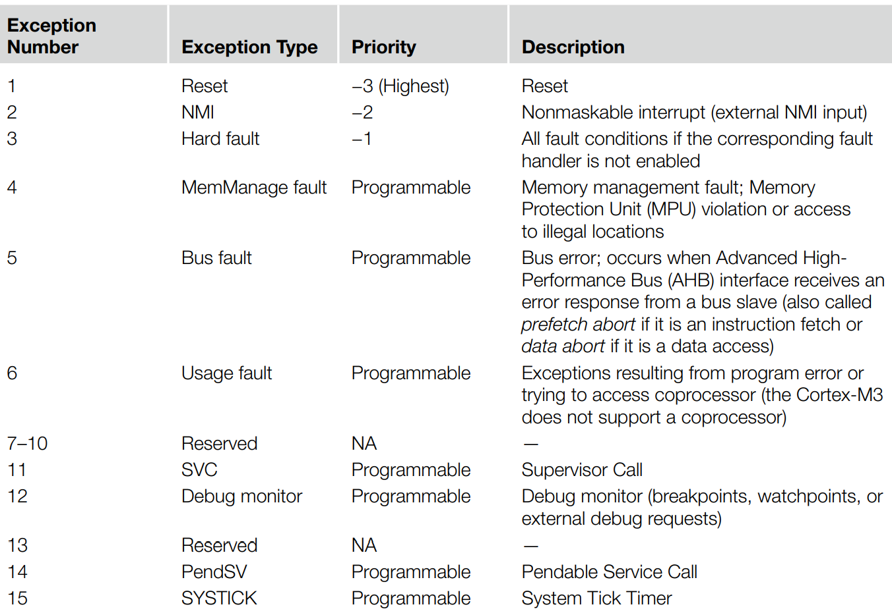
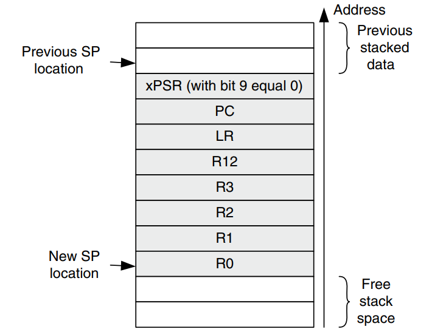
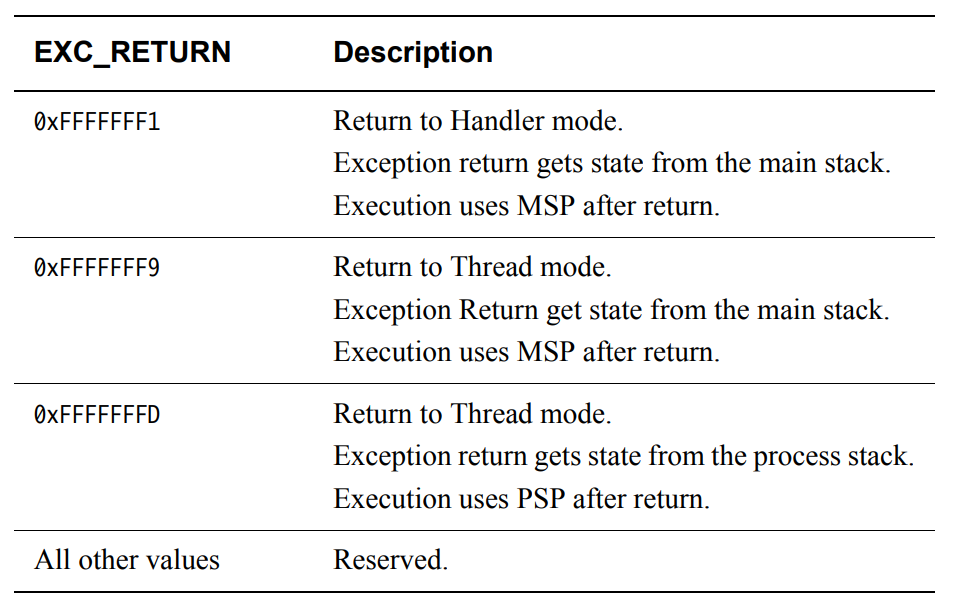

8、异常
==========================================

| 这一小节我们来看下异常处理流程
| 参考文档：
| DUI0552A_cortex_m3_dgug.pdf
| The Definitive Guide to the ARM® Cortex-M3

8.1 系统异常 
-------------------------------------------

.. note::
	| 1. 除了reset、NMI、hardfault 外，其他的异常优先级都可配置

8.2 异常进入和退出
-------------------------------------------

.. note::
	| 进入异常需要做几件事情：
	| 1. Stacking (pushing eight registers’ contents to stack)
	| 2. Vector fetch (reading the exception handler starting address from the vector table)
	| 3. Update of the stack pointer, link register (LR), and program counter (PC)

.. note::
	| 进入异常时，需要更新lr值，如上所示，让系统知道从异常返回后进入handler模式还是thread模式，另外属于特权还是非特权

.. note::
	| 注意这里core帮我们保存到stack的寄存器是符合c语言函数调用规范的（栈帧），加上返回是core能通过lr知道状态，所以M系统的异常处理函数可以直接使用C代码来实现。
	| 异常按照优先级可以嵌套，都可以保存到栈中，一级一级压栈，再一级一级恢复即可。

