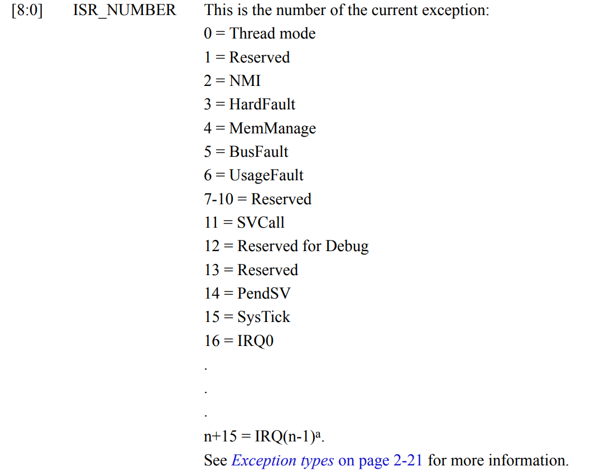

2、代码编译运行
==========================================

2.1 代码准备
-------------------------------------------

代码包含异常向量表和几行代码。向量表的原因是 M3 core启动时，会先从这个地址取指令所在地址，然后赋值给PC执行。

.. code-block:: asm

	/*
	* Copyright (c) 2021-2008, Jinping Wu. All rights reserved.
	*
	* SPDX-License-Identifier: MIT
	*/

	__Vectors:
		.long		0x12345678			/*     Top of Stack */
		.long		Reset_Handler		/*     Reset Handler */
		.long		0x11111111		
		.long		0x22222222		

		.thumb_func
	Reset_Handler:
		mov		r0, #1
		mov		r1, #2
		mov		r2, #3
		b		.
		mov		r2, #4

.. note::
 参考手册 DUI0552A_cortex_m3_dgug.pdf ，core执行时会从 0x4 地址取出要执行的第一行代码的地址，我们这里Reset_Handler函数是入口函数，放到 0x4 地址， thumb模式需要加上个 .thumb_func， 
 Reset_Handler 地址和放入 0x4 的地址值偏差1，core取指时会自动把1减掉后调用到Reset_Handler去执行。

这段代码开头定义了异常向量表，0x4 地址放入口函数 Reset_Handler， Reset_Handler 函数本身给寄存器 r0~r3 分别赋值 1，2,3. 然后b . 跳转到本行，即在一直循环执行这一行。

使用交叉编译工具，先导出：

::

	export PATH="/root/workspace/.toolchains/gcc-arm-none-eabi-10-2020-q4-major/bin/:$PATH"

::

	arm-none-eabi-gcc -nostdlib -e 0x0 -Ttext=0x0 -mthumb -mcpu=cortex-m3 test.S -o test.elf

The Cortex-M3 processor only supports execution of instructions in Thumb state, The following
can clear the T bit to 0:
• instructions BLX, BX and POP{PC}
• restoration from the stacked xPSR value on an exception return
• bit[0] of the vector value on an exception entry or reset.

.. note::
 -e 0x0 告诉gcc生成 elf 时，指定入口地址为 0x0， -Ttext=0x0 表示 .text 代码段是从 0x0 开始放的， 
 -mthumb 使用 thumb指令（指令长度16、32混合）、-mcpu=cortex-m3 指定cpu为 cortex-m3.

::

 	arm-none-eabi-objdump -xD test.elf > test.asm

DUMP出 ELF 内容，可以看到(部分内容)：

::

	test.elf:     file format elf32-littlearm
	test.elf
	architecture: armv7, flags 0x00000112:
	EXEC_P, HAS_SYMS, D_PAGED
	start address 0x00000000

	Program Header:
		LOAD off    0x00010000 vaddr 0x00000000 paddr 0x00000000 align 2**16
			filesz 0x0000001c memsz 0x0000001c flags r-x
	private flags = 5000200: [Version5 EABI] [soft-float ABI]

	Sections:
	Idx Name          Size      VMA       LMA       File off  Algn
	0 .text         0000001c  00000000  00000000  00010000  2**2
					CONTENTS, ALLOC, LOAD, READONLY, CODE
	1 .ARM.attributes 0000001b  00000000  00000000  0001001c  2**0
					CONTENTS, READONLY
	2 .noinit       00000000  0001001c  0001001c  00010037  2**0
					CONTENTS

这里可以看到arch变成了armv7

.. code-block:: python

	00000000 <__Vectors>:
	0:	12345678 	eorsne	r5, r4, #120, 12	; 0x7800000
	4:	00000011 	andeq	r0, r0, r1, lsl r0
	8:	11111111 	tstne	r1, r1, lsl r1
	c:	22222222 	eorcs	r2, r2, #536870914	; 0x20000002

	00000010 <Reset_Handler>:
	10:	2001      	movs	r0, #1
	12:	2102      	movs	r1, #2
	14:	2203      	movs	r2, #3
	16:	e7fe      	b.n	16 <Reset_Handler+0x6>
	18:	2204      	movs	r2, #4

.text 段从0x0开始，0x4 放的 0x00000011， 而我们的 Reset_Handler 地址为 0x00000010 ，符合我们预期（thumb模式地址+1）

::

	arm-none-eabi-objcopy -O binary test.elf test.bin

从 ELF 中导出可执行 binary 文件。我们一般 QEMU 会使用 ELF文件（qemu会解析），而实际的板子会使用bin文件，比如把bin文件烧到flash

::

	xxd test.bin

.. code-block:: hexdump

	00000000: 7856 3412 1100 0000 1111 1111 2222 2222  xV4.........""""
	00000010: 0120 0221 0322 fff7 feff 0422            . .!."....."

可执行文件一共就28 bytes

.. note::
 编译链接涉及的内容很庞大，不在我们讨论范围内，只做简单说明，满足我们使用即可。

2.2 运行
-------------------------------------------

接下来我们用 qemu 来运行刚刚编译出来的elf, 新开一个终端窗口：

::

	export PATH="/root/workspace/software/qemu/qemu-6.0.0/build/:$PATH"

导出环境变量

::

	qemu-system-arm  -machine mps2-an385 -monitor null -semihosting  --semihosting-config enable=on,target=native  -kernel test.elf  -serial stdio -nographic  -s -S

.. note::
 QEMU 命令，-machine mps2-an385 表示使用 mps2-an385这个平台， -kernel test.elf 即加载执行我们这里编译出来的 test.elf, -s -S 会让 qemu 停在第一行代码，等待gdb 链接。

再新开一个终端窗口，运行gdb：

::

	export PATH="/root/workspace/.toolchains/gcc-arm-none-eabi-10-2020-q4-major/bin/:$PATH"

导出环境变量

::

	arm-none-eabi-gdb -ex 'target remote localhost:1234' -ex "add-symbol-file test.elf" -q

.. note::
 GDB 命令，add-symbol-file test.elf 即导入我们的elf作为符号表，连接到我们的上一个窗口 qemu 上。

::

	(gdb) display /ni $pc
	1: x/i $pc
	=> 0x10 <Reset_Handler>:        movs    r0, #1

当前停在0x10第一条指令，说明core reset成功了，并且从0x4 地址取到了第一条指令的地址（0x10），跳转到 0x10 执行。

::

	(gdb) info reg
	r0             0x0                 0
	r1             0x0                 0
	r2             0x0                 0
	r3             0x0                 0
	r4             0x0                 0
	r5             0x0                 0
	r6             0x0                 0
	r7             0x0                 0
	r8             0x0                 0
	r9             0x0                 0
	r10            0x0                 0
	r11            0x0                 0
	r12            0x0                 0
	sp             0x12345678          0x12345678
	lr             0xffffffff          -1
	pc             0x10                0x10 <Reset_Handler>
	xpsr           0x41000000          1090519040

寄存器情况，当前r0~r12都是0，符合预期

.. note::
 栈指针，sp， reset后默认使用MSP，并且地址是从0x0 取出来的，我们代码中0x0 写的是0x12345678，所以core reset起来后，自动从这个地址取值，赋给了 sp 寄存器

xpsr isr number说明（手册DUI0552A_cortex_m3_dgug.pdf page 19）

xpsr 的低位用于说明当前处于哪种模式，reset后默认处于thread mode，对应是0，符合预期。

::

	(gdb) si
	0x00000012 in Reset_Handler ()
	1: x/i $pc
	=> 0x12 <Reset_Handler+2>:      movs    r1, #2
	(gdb) info reg $r1
	r1             0x0                 0
	(gdb) info reg $r0
	r0             0x1                 1
	(gdb)

执行完第一条命令，“mov		r0, #1”， r0 变成1， 符合预期

::

	(gdb) info reg
	r0             0x1                 1
	r1             0x2                 2
	r2             0x3                 3
	r3             0x0                 0
	r4             0x0                 0
	r5             0x0                 0
	r6             0x0                 0
	r7             0x0                 0
	r8             0x0                 0
	r9             0x0                 0
	r10            0x0                 0
	r11            0x0                 0
	r12            0x0                 0
	sp             0x12345678          0x12345678
	lr             0xffffffff          -1
	pc             0x16                0x16 <Reset_Handler+6>
	xpsr           0x1000000           16777216

一直往下执行到循环体，r0,r1,r2 被赋值位1,2,3. 符合我们的预期。

这样，我们用了最简单的几行代码，让 Cortex M3 跑起来了。
